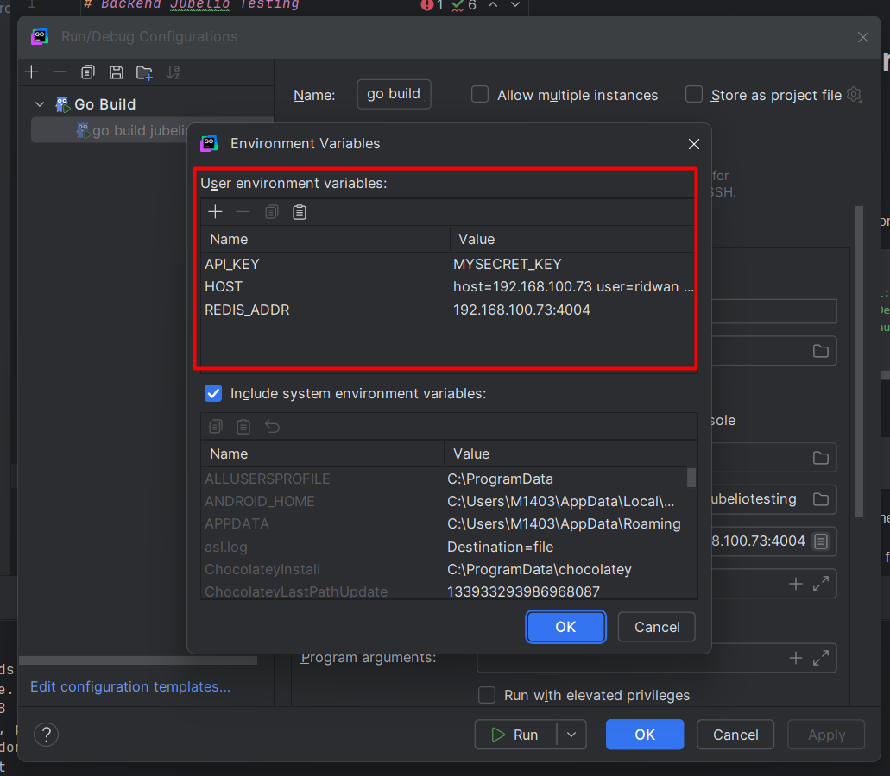

# Backend Jubelio Testing

This test using golang to handle backend and API.

## Before running,
Before running this backend, please to update the config.go inside /pkg/config/config.go

```go
type GetEnvConfig struct {
	Host      string `env:"HOST" envDefault:"host=localhost user=ridwan password=mypassword dbname=jubeliotest port=5432 sslmode=disable TimeZone=Asia/Jakarta"`
	RedisAddr string `env:"REDIS_ADDR" envDefault:"localhost:6379"`
	APIKey    string `env:"API_KEY" envDefault:"SECRET_KEY"`
}
```

**or using package 
```
github.com/caarlos0/env/v11
```
If using this package, if you use goland, please set the env on this.**



### Parameters on Environment
1. Host (on env is HOST) -> please update with your local connection to Postgres
2. RedisAddr (on env is REDIS_ADDR) -> please update with your redis connection
3. APIKey (on env is API_KEY) -> please update with your own secret key.
For the APIKey make sure to make a same KEY with frontend environment.